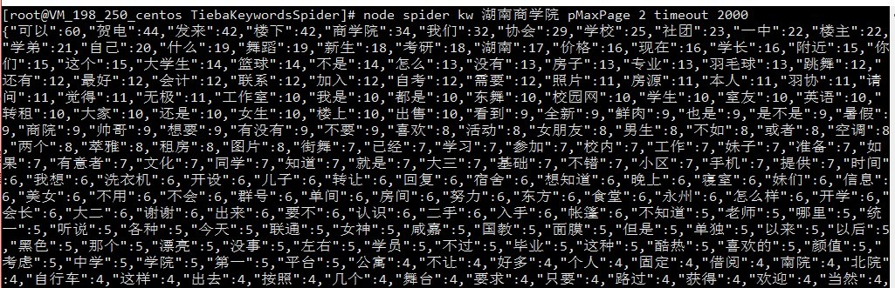

## 贴吧关键词爬虫

队列爬虫
爬取单层楼后会根据非中文字符进行分割，一个分割块内的多个关键词仅统计一次

### 配置
```js
module.exports = {
    kw: ['湖南商学院'], //可以一次性爬多个贴吧
    pMaxPage: 1, //单个贴子最大翻页数
    kwMaxPage: 1, //如果查非大型贴吧最好仅爬1页，不然可能会因为到了最后一页有重复爬取的可能性
    requestDelay: 100, //请求延时，这个没什么用了
    timeout: 3000, //超时时间，以防出现忙等待的情况
}
```

### 安装
> npm install

### 运行
> node spider

也可以通过控制台传入参数，所有参数均可选，没有传入的参数默认使用配置文件的参数
> node spider kw 李毅 timeout 1000

#### 运行效果
可能等待时间会非常久

